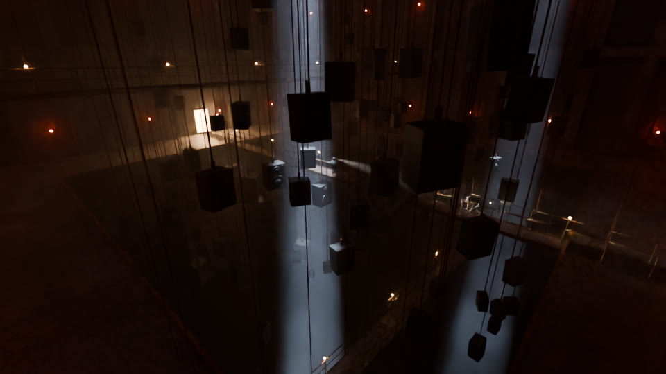
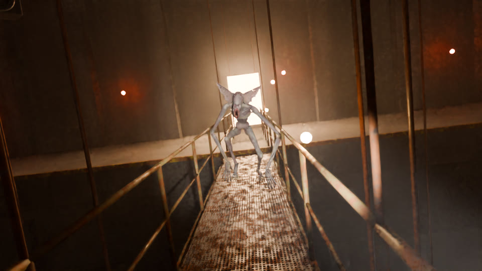
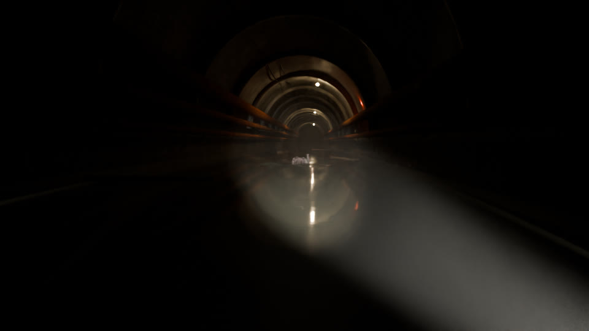
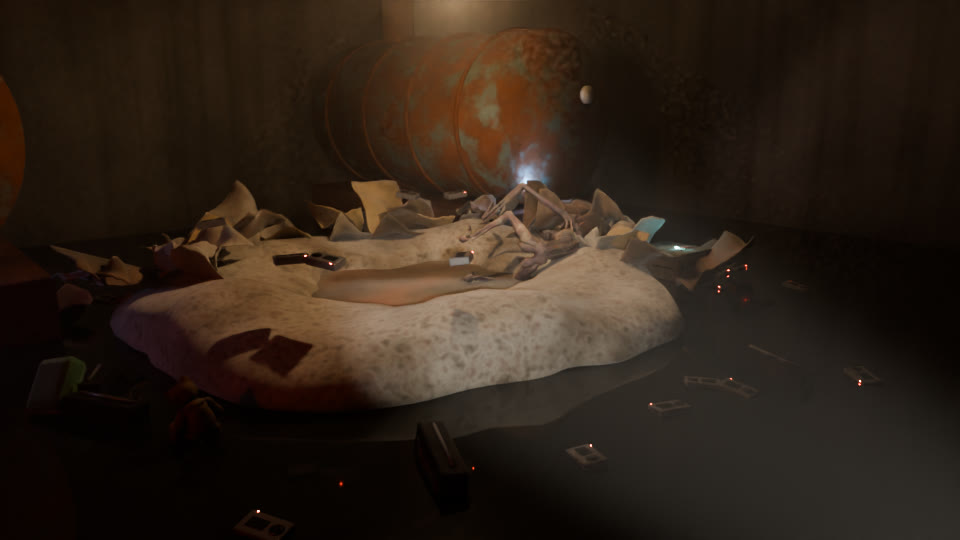
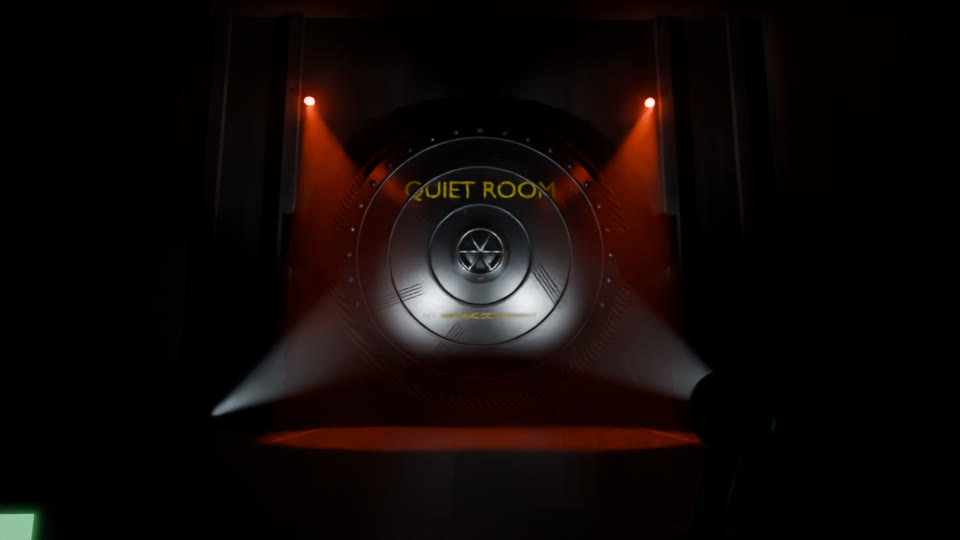
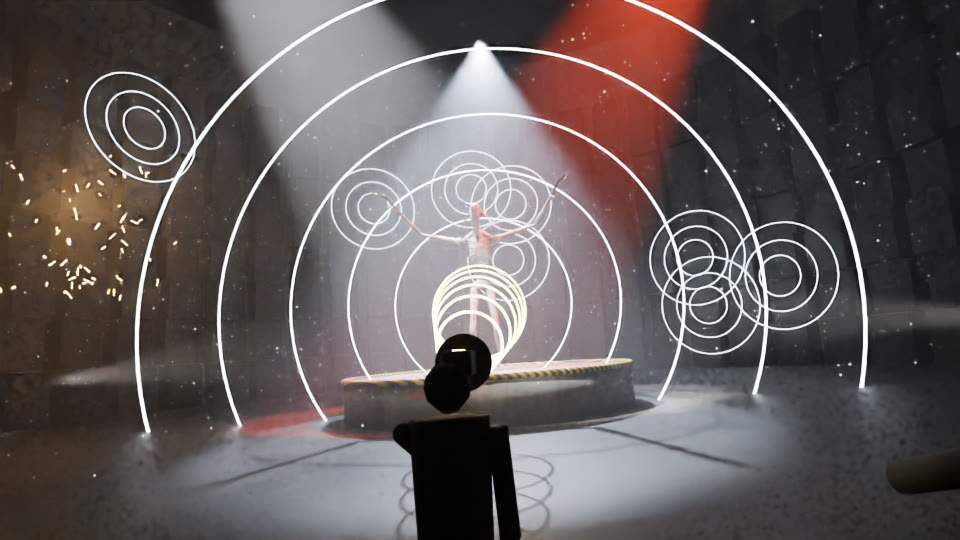

# Concept art: what each map could look like

Made with the scripts in `art/concept/` (Blender Cycles, the real monster model). These are mood
pieces for the chapters in [`../STORY.md`](../STORY.md), not in-game screenshots.

## Prologue: The Hale House, and Chapter 1: Halcyon Acoustics
AI concept images in the owner's Canva account (open the links):
[kitchen](https://www.canva.com/M/MAHXVWTps9s) ·
[upstairs hallway](https://www.canva.com/M/MAHXVb7NaLg) ·
[Halcyon lobby](https://www.canva.com/M/MAHXVVcH7AU) ·
[the Echo lab](https://www.canva.com/M/MAHXVQ5WZpY)

## Chapter 2: The Echo Halls
A colossal reverb chamber: a bottomless pit, catwalks, a forest of speakers hanging on chains,
cold light shafts from the ceiling vents. You're on the main catwalk; it waits across the gap.

The catwalk chase: look back, and it's coming.

## Chapter 3: The Nest
The flooded tunnel. Waist-deep black water, and something pale gliding under the surface ahead.

The heist: it's asleep in its nest of torn coats, surrounded by the recorders it uses as bait and
the kids' things. The override keycard glows on a crate right beside its head.

## Chapter 4: The Quiet Room
The vault door, seen from the control room: "QUIET ROOM", claw marks gouged into the steel.

The "Feedback" ending: every speaker blasting at once while the Echo fires into it.

These are 960×540 previews. For full 1920×1080 renders, run each script without `preview` (see
`art/concept/README.md`). Ideas for a next pass: make the swimming monster in the tunnel shot
more readable, and give the boss-fight players real character models.
